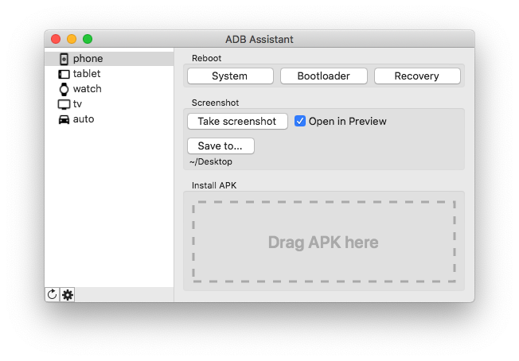
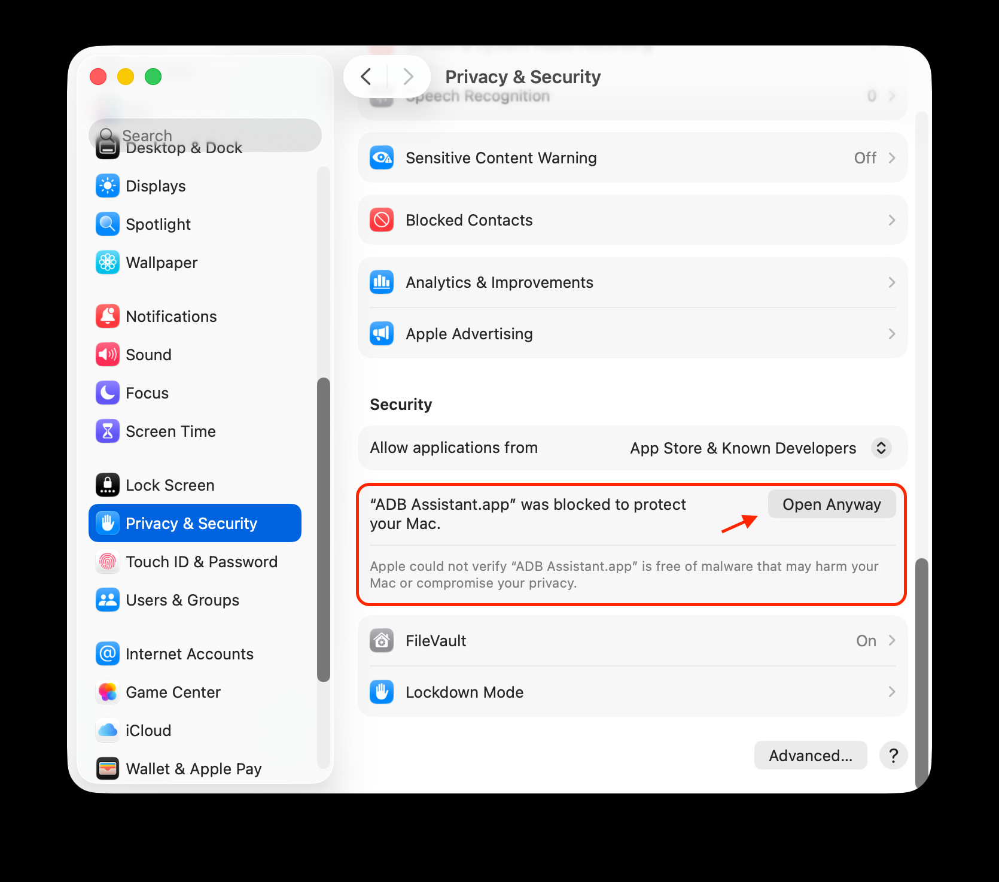

## ADB Assistant

**ADB Assistant** is a macOS GUI wrapper for the ADB (Android Debug Bridge) command-line tool. It lets you communicate with connected Android devices and perform common tasks from your Mac.

Currently it provides the ability to:

* **Choose a device** from the list of connected devices
* **Reboot the device** into
  * System
  * Recovery
  * Bootloader
* **Capture screenshots** and save them to your Mac
* **Install APKs** with an easy drag-and-drop workflow

## Installation

* Download the latest binary from the Releases page and move it to your Mac's Applications folder
* [Install the latest Android Platform Tools](https://developer.android.com/studio/releases/platform-tools) from Google, or via Homebrew: `brew install --cask android-platform-tools`
* Launch the app and specify the Platform Tools path (Homebrew installs them at `/usr/local/share/android-sdk/platform-tools`)
* If macOS warns that the app is from an unverified developer, open System Settings → Privacy & Security and allow the app to run  

## Usage

* Enable Developer Options on your Android device (tap the build number 5–7 times in Settings → About phone), then turn on USB debugging
* Connect the device and the app will automatically detect it and display the available actions

## Build

The app has no external dependencies — just clone the repo and build it with the latest version of Xcode.

## Credits

The project was developed by Michail Ovchinnikov.

## License

The project is distributed under MIT License.
