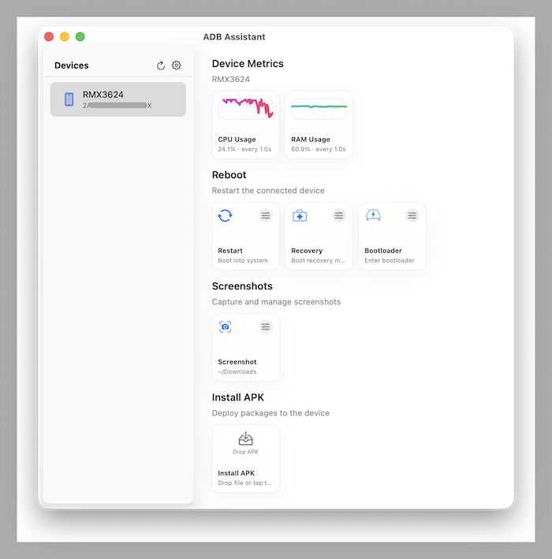
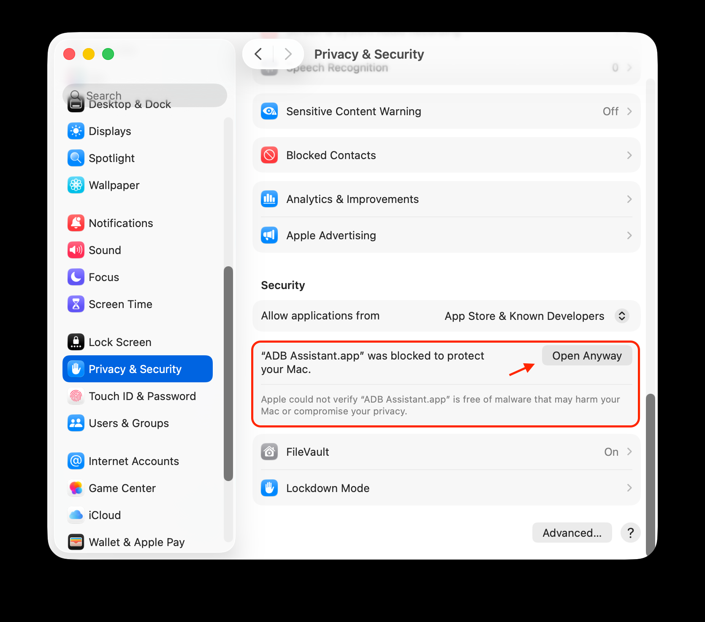

## ADB Assistant

**ADB Assistant** is a macOS GUI wrapper for the ADB (Android Debug Bridge) command-line tool. It lets you communicate with connected Android devices and perform common tasks from your Mac.

Currently it provides the ability to:

* **Choose a device** from the list of connected devices
* **Reboot the device** into
  * System
  * Recovery
  * Bootloader
* **Capture screenshots** and save them to your Mac
* **Install APKs** with an easy drag-and-drop workflow

## Installation

* Download the latest binary from the Releases page and move it to your Mac's Applications folder
* [Install the latest Android Platform Tools](https://developer.android.com/studio/releases/platform-tools) from Google, or via Homebrew: `brew install --cask android-platform-tools`
* Launch the app and specify the Platform Tools path (Homebrew installs them at `/usr/local/share/android-sdk/platform-tools`)
* If macOS warns that the app is from an unverified developer, open System Settings → Privacy & Security and allow the app to run  

## Usage

* Enable Developer Options on your Android device (tap the build number 5–7 times in Settings → About phone), then turn on USB debugging
* Connect the device and the app will automatically detect it and display the available actions

## Build

The app has no external dependencies — just clone the repo and build it with the latest version of Xcode.

## Capability Architecture

The app is organized around **Capabilities**. A capability is a reusable feature slice that includes:

- **Infrastructure implementation** (ADB operations)
- **Domain use case(s)** (business flow)
- **Presentation tiles/settings UI**

### Why this architecture

- avoids a single god object for all device operations
- keeps features modular and easier to extend
- allows contributors to add new functionality without rewriting core dashboard code

### Infrastructure contracts

Instead of a single `DeviceGateway`, the Domain now defines focused gateway protocols:

- `DeviceDiscoveryGateway`
- `DeviceRebootGateway`
- `DeviceScreenshotGateway`
- `DevicePackageGateway`
- `DeviceMetricsGateway`

Use cases share the `GatewayFactory` contract and call only the specific `make*Gateway(...)` method they need.

### UI composition

Dashboard UI is composed by `CapabilityRegistry` (`Presentation/Models/CapabilityRegistry.swift`).
Each capability is represented by a `CapabilityUIProvider` that supplies:

- section metadata
- tile view(s)
- settings view(s)

This allows new capabilities to be plugged in by registration, not by editing one large switch.

## Contributor Guide: Add a New Capability

This section explains how to add your own capability and open a contribution PR.

### 1) Define (or reuse) domain interfaces

If your feature needs new ADB operations, add a focused gateway protocol in:

- `ADB Assistant/Domain/Interfaces/DeviceGateway.swift`

Keep interfaces narrow and capability-specific. If a new gateway constructor is needed, add it to `GatewayFactory` in the same file.

### 2) Implement infrastructure

Add the ADB command implementation in `Infrastructure/ADB`:

- add or update a focused gateway file (for example `ADBDiscoveryGateway.swift`)
- expose it through `ADBGatewayFactory` in `ADBGatewayFactory.swift`

### 3) Add/extend use case(s)

Create or update use cases in `ADB Assistant/Domain/UseCases/`.
Use the shared `GatewayFactory` and call only the `make*Gateway(...)` method needed by the use case.

### 4) Add UI provider

Register your capability in `CapabilityRegistry.makeDefault()` (`Presentation/Models/CapabilityRegistry.swift`) by adding a new `CapabilityUIProvider` implementation:

- define section id/title/subtitle/order
- define tile id(s)
- return tile view(s) in `makeTileView(...)`
- return settings view(s) in `makeSettingsView(...)`

### 5) Hook user actions into AppState/application services

Reuse existing app services/coordinators where possible:

- `DeviceActionsService`
- `DeviceMetricsCoordinator`
- `DeviceEventsCoordinator`
- `AppPreferencesService`

If needed, add a new focused service instead of expanding `AppState`.

### 6) Add files to Xcode project

If you add new source files, include them in `ADB Assistant.xcodeproj/project.pbxproj` under:

- correct group
- target Sources build phase

### 7) Validate locally

- build: `xcodebuild -project "ADB Assistant.xcodeproj" -scheme "ADB Assistant" -configuration Debug -sdk macosx build`
- ensure lint/format pass via Xcode build scripts

### 8) Open a contribution PR

Recommended PR structure:

- short summary of capability and user value
- architecture notes (new interfaces/use cases/providers)
- test/verification notes
- screenshots or gif for new UI tiles/settings

Keep PRs focused to one capability at a time.

## Credits

The project was developed by Michail Ovchinnikov.

## License

The project is distributed under MIT License.
